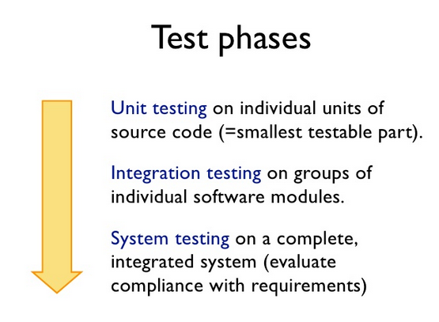
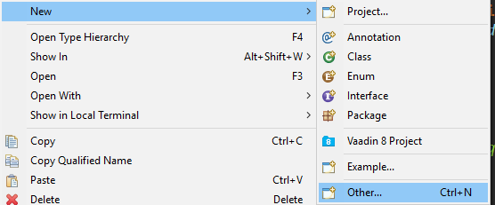
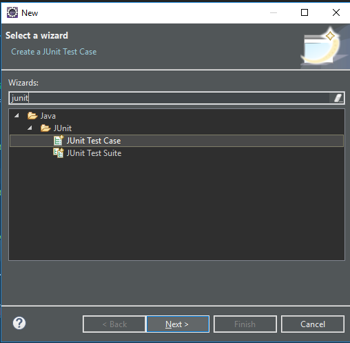
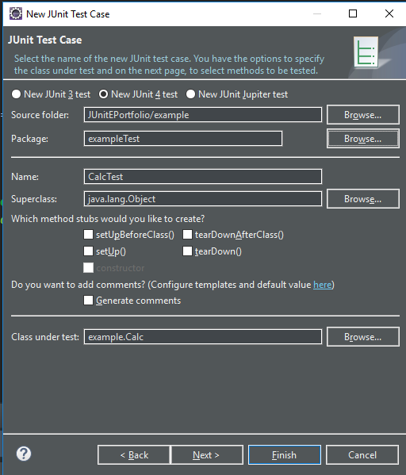
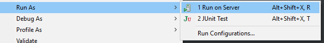
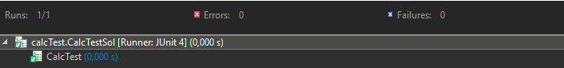
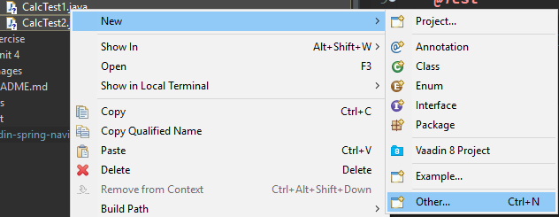
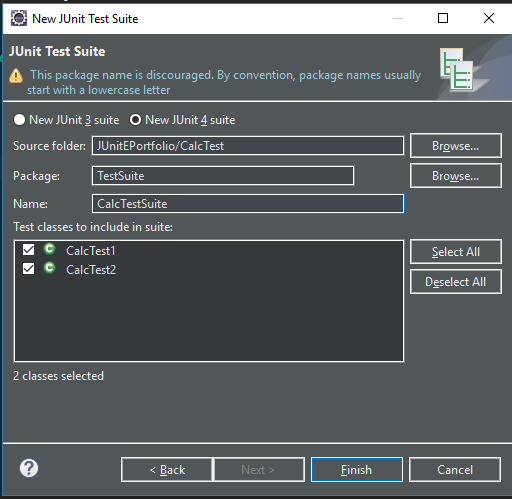

# JUnitEPortfolio

## Table of Contents
  - [1. JUnit](#1-junit)
- [2. Software Testing](#2-software-testing)
  * [2.1 Phases of testing](#21-phases-of-testing)
  * [2.2 Advantages](#22-advantages)
- [3 Using JUnit](#3-using-junit)
  * [3.1 How to define a test in JUnit?](#31-how-to-define-a-test-in-junit-)
  * [3.2 Assert statements](#32-assert-statements)
  * [3.3 Example JUnit test](#33-example-junit-test)
  * [3.4 JUnit naming conventions](#34-junit-naming-conventions)
- [4 JUnit integration in Eclipse](#4-junit-integration-in-eclipse)
  * [4.1 Project preparation](#41-project-preparation)
  * [4.2 Create a Java class](#42-create-a-java-class)
  * [4.3 Create a JUnit test](#43-create-a-junit-test)
  * [4.4 Run your test](#44-run-your-test)
  * [4.5 JUnit in IntelliJ](#45-junit-in-intellij)
- [5 Additonal information](#5-additonal-information)
  * [5.1 JUnit Test Suites](#51-junit-test-suites)
  * [5.2 Annotations](#52-annotations)
  

## 1. JUnit
JUnit is an open source framework that has been designed for the purpose of writing and running tests in the java programming language. Origininally it was written by Erich Gamma and Kent Beck. The goal of the framework is to accelerate programming and to increase the quality of code. It is one of a family of unit testing framework which is collectively known as XUnit.

## 2. Software Testing
A software test is a piece of code, which executes another piece of software. It validates if that code results in the expected state (state testing) or executes the expected sequence of events (behavior testing). This helps to verify that logic of a program is correct and creates a relation ship between developing and testing. 

### 2.1 Phases of testing
 


Here we are doing Unit tests.
 
### 2.2 Advantages
Software unit tests help the developer to verify that the logic of the program is correct. Running tests automatically helps to identify software regressions in the source code. Having a high test coverage of your code allows you to continue developing features without having to perform lots of manual tests.

## 3 Using JUnit
JUnit is a test framework that uses annotations to identify methods that specify a test. 

### 3.1 How to define a test in JUnit?
A Junit test is a method contained in a class which is only used for testing. This is called a _Test class_. To define a certain method is a test method, annotate it with the `@Test` annotation. 
In addition to this annotations there are also some other annotations that are used in JUnit.
##### Annotation Types Summary
| Annotation JUnit4 | Description |
|----|----|
| import org.junit.* | Import statement for using the following annotations. |
| @After | Executed after each test. It is used to cleanup the test environment (e.g., delete temporary data, restore defaults). It can also save memory by cleaning up expensive memory structures. |
| @AfterClass | Executed once, after all tests have been finished. It is used to perform clean-up activities, for example, to disconnect from a database. Methods annotated with this annotation need to be defined as static to work with JUnit. |
| @Before | Executed before each test. It is used to prepare the test environment (e.g., read input data, initialize the class). |
| @BeforeClass | Executed once, before the start of all tests. It is used to perform time intensive activities, for example, to connect to a database. Methods marked with this annotation need to be defined as static to work with JUnit. |
| @Ignore | Marks that the test should be disabled. This is useful when the underlying code has been changed and the test case has not yet been adapted. Or if the execution time of this test is too long to be included. It is best practice to provide the optional description, why the test is disabled. |
| @Test | Identifies a method as a test method. |
| @Test(expected = Exception.class) | Fails if the method does not throw the named exception. |
| @Test(timeout=100) | Fails if the method takes longer than 100 milliseconds. |


### 3.2 Assert statements
JUnit provides static methods to test for certain conditions via the *Assert* class. These assert statements typically start with *assert*. They allow you to specify the error message, the expected and the actual result. An assertion method compares the actual value returned by a test to the expected value. It throws an *AssertionException* if the comparison fails.
The following table gives an overview of these methods. Parameters in [] brackets are optional and of type String.
##### Assert statements
| Statement | Description |
|----|----|
| fail([message]) | Let the method fail. Might be used to check that a certain part of the code is not reached or to have a failing test before the test code is implemented. The message parameter is optional. |
| assertTrue([message,] boolean condition) | Checks that the boolean condition is true. |
| assertFalse([message,] boolean condition) | Checks that the boolean condition is false. |
| assertEquals([message,] expected, actual) | Tests that two values are the same. Note: for arrays the reference is checked not the content of the arrays. |
| assertEquals([message,] expected, actual, tolerance) | Test that float or double values match. The tolerance is the number of decimals which must be the same. |
| assertNull([message,] object) | Checks that the object is null. |
| assertNotNull([message,] object) | Checks that the object is not null. |
| assertSame([message,] expected, actual) | Checks that both variables refer to the same object. |
| assertNotSame([message,] expected, actual)  | Checks that both variables refer to different objects. |


### 3.3 Example JUnit test
The following code shows a test using JUnit4. This test assumes that the `Calc` class exists and has  `add(int a, int b); sub(int a, int b); mul(int a, int b); div(int a, int b)`methods.
```java
import static org.junit.Assert.*;

import org.junit.Test;

import test.Calc;

public class CalcTestSol {

	public static Calc cal;

	@BeforeClass
	public static void init() {
		cal = new Calc(2, 2);

	}
	
	@Test
	public void additionTest() {
		int add = cal.add();
		assertEquals(add, 4);
	}

	@Test
	public void subtractionTest() {
		int sub = cal.sub();
		assertEquals(sub, 0);
	}

	@Test
	public void multiplicationTest() {
		int mul = cal.mul();
		assertEquals(mul, 4);
	}

	@Test
	public void divisionTest() {
		int div = cal.div();
		assertEquals(div, 1);
	}

}


```
### 3.4 JUnit naming conventions
There are several potential naming conventions for JUnit tests. A widely-used solution for classes is to use the "Test" suffix at the end  of test classes names. A test name should explain what the test does. If that is done correctly, reading the actual implemantation can be avoided.
One possible convention is to use the "should" in the test method name. For example "balanceShouldIncrease". This gives a hint what should happen if the test method is executed. 
Another approach is to use "Given[ExplainYourInput]When[WhatIsDone]Then[ExpectedResult]" for the display name of the test method.


## 4 JUnit integration in Eclipse
### 4.1 Project preparation
To run a JUnit test you have to create a new project. In your project you have to create two source folders, one for the normal java classes and one for JUnit test classes. (This is not needed but it is a better way to get clarity) You can add a source folder by right-clicking on a project and selecting New ▸ Source Folder.

### 4.2 Create a Java class
In the source folder that contains the Java classes you create a new Java class. For example a `Calc` class.
```java
package calc;

public class Calc {

	private int a;
	private int b;
	
	public Calc(int a, int b) {
		this.a = a;
		this.b = b;
	}
	
	public int add() {
		return a + b;
	}
	public int sub() {
		return a - b;
	}
	public int mul() {
		return a*b;
	}
	public int div() {
		return a / b;
	}
	
	
```

### 4.3 Create a JUnit test
To create a new JUnit test for a class you have to right-click on your class in the Package Explorer and to select a new JUnit test case.




In the following wizard you have to ensure that the New JUnit 4 test is set and set the source folder to `CalcTest`, so that your test gets created in this folder.

 

After that click finish and a new test will be created.
There will be created a test class with the following code.
```java
package calcTest;

import static org.junit.Assert.*;

import org.junit.Test;

public class CalcTest {

	@Test
	public void test() {
		fail("Not yet implemented");
	}

}
```

### 4.4 Run your test
To run your JUnit test you have to right-click on your new test class and select Run-As ▸ JUnit Test.


The result of the tests are displayed in the JUnit view.



### 4.5 JUnit in IntelliJ

To run JUnit in Intellij you can follow this [link](https://blog.jetbrains.com/idea/2006/03/running-junit-4-tests-in-intellij-idea-51/)

## 5 Additonal information

### 5.1 JUnit Test Suites
If you have several test classes, you can combine them into a test suite. Running this test suites executes all test classes in a specific order. A test suite can also contain other test suites.

To create a test suite in Eclipse you have to do the following steps.

Select all test classes and choose new ▸ other ▸ JUnitTestSuite



Afterwards you can create a new test suite.



Then a new JUnit Test Suite will be created.
```java 
import org.junit.runner.RunWith;
import org.junit.runners.Suite;
import org.junit.runners.Suite.SuiteClasses;

@RunWith(Suite.class)
@SuiteClasses({ CalcTest1.class, CalcTest2.class })
public class CalcTestSuite {

}
```


### 5.2 Annotations

Beside the basic annotations _@Test @Before @After @AfterClass @BeforeClass @Ignore @Runwith_ there are also other annotations that can be used in JUnit. 
The most important ones are _Parameterized test, Category and Rule_. You can see all this annotations [here](https://github.com/junit-team/junit4/search?p=2&q=%22%40interface%22&type=Code).
